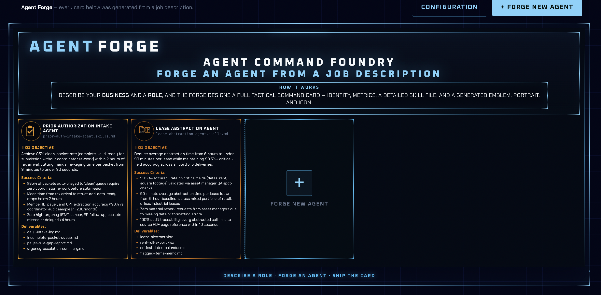
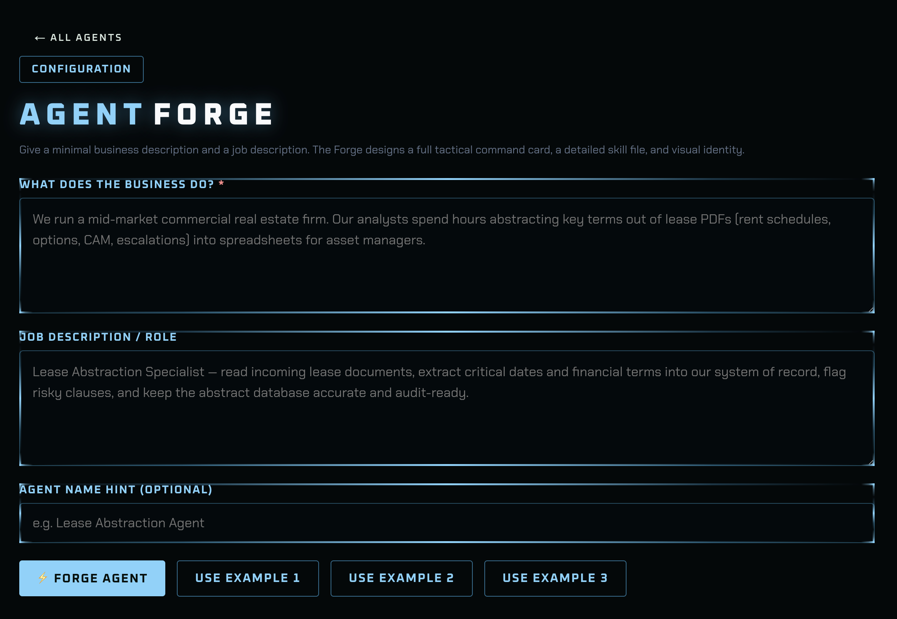
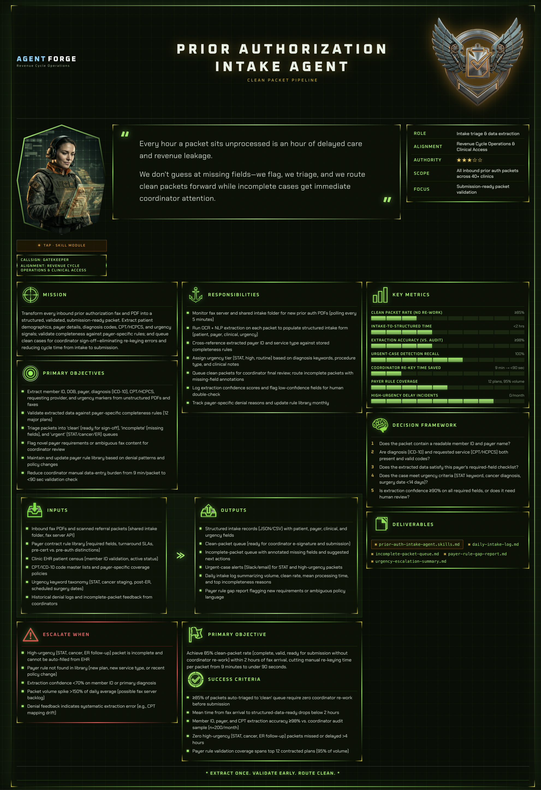

# Agent Forge

**Turn a job description into a deployable AI operator — in minutes.**

Agent Forge takes a short business description and a role, then generates a complete tactical **command card**: identity, mission, metrics, decision framework, a detailed Markdown **skill file**, and a custom **emblem, portrait, and icon**. Everything ships in a Command & Conquer–style HUD built for operators, not slide decks.

Describe a role. Forge an agent. Ship the card.

---

## See it in action

### Agent roster

Your forged agents live on a live-updating command grid. Cards fill in as generation runs — identity first, visuals early, skill file last.



### Forge form

Paste your business context and job description — or load **Use Example 1 / 2 / 3** for CRE lease abstraction, AP automation, or prior auth intake.



### Command card detail

Every agent gets a full tactical drill-in: mission, objectives, I/O, metrics, escalation rules, deliverables, and a tap-to-open skill module.



---

## Why Agent Forge

| You bring | Agent Forge delivers |
|-----------|----------------------|
| A business context + job description | A named agent with callsign, authority rank, and accent theme |
| A vague role (“handle prior auth intake”) | Mission, Q1 objective, success criteria, and decision framework |
| Nothing visual | Gemini-generated emblem, portrait, and HUD icon (with transparency pipeline) |
| Tribal knowledge in people's heads | A 180–320 line Markdown skill file your team (or another AI) can run tomorrow |

**Built for:**

- **Ops leaders** prototyping agent roles before wiring them into production
- **Solutions teams** demoing document-intelligence workflows to customers
- **Builders** who want opinionated agent specs, not blank ChatGPT threads

**Not another chat UI.** Agent Forge is a foundry: structured output, persistent roster, editable prompts, and a UI your stakeholders actually want to open.

---

## Quick start

```bash
git clone https://github.com/tguless/agent-forge.git
cd agent-forge
npm install
cp .env.example .env.local   # add ANTHROPIC_API_KEY (+ GEMINI_API_KEY for visuals)
./start.sh                   # http://localhost:3030
```

1. Open **Forge new agent** (or the **+** tile on the roster).
2. Fill in business + role — or click **Use Example 1**.
3. Watch the live forge log; open the command card when complete.
4. Tap the portrait to read the generated skill module.

Optional: tune every LLM prompt under **Configuration** (`/config`).

---

## What's included

- **Live roster grid** — agents update while forging
- **Three example presets** — CRE, AP automation, healthcare prior auth
- **Forge Configuration** — edit Anthropic system prompts, meta skills, and Gemini image templates (SQLite-backed)
- **Skill module overlay** — GFM Markdown with tables, same renderer in config preview
- **Visual identity pipeline** — Nano Banana (Gemini) + rembg + ImageMagick, graceful fallbacks
- **Local-first** — SQLite database, no cloud dependency beyond LLM/image APIs

---

## Technical reference

### How it works

```
/new (business + job description)
   → POST /api/agents/generate
       → Claude tool-use loop (src/lib/server/agentRunner.ts)
           set_identity
           → generate_image (emblem, portrait, icon)  [Gemini + rembg + magick]
           → set_narrative → set_lists → set_metrics
           → write_skill_file
           → finalize
       → writes to SQLite (data/forge.db) + emits generation events
   → live progress log (polls /api/agents/[slug]/events)
/        → index grid of all forged agents
/agent/[slug] → full command card + tap-to-open skill module
/config  → edit all LLM prompts (Anthropic + Gemini), stored in forge_config
```

Meta-skills (how to design identity, author the skill file, and choose visuals) live in [`skills/`](./skills) and are injected into the system prompt. Overrides from `/config` take precedence.

### Setup

```bash
cd agent-forge
npm install
cp .env.example .env.local   # fill in your keys
npm run dev                  # http://localhost:3030
# or
./start.sh                   # pins Node 18 via nvm + rebuilds better-sqlite3 if needed
```

### Environment (`.env.local`)

| Variable | Required | Purpose |
|----------|----------|---------|
| `ANTHROPIC_API_KEY` | **Yes** | The agent brain (identity, copy, skill file). |
| `ANTHROPIC_MODEL` | No | Defaults to `claude-sonnet-4-5`. |
| `GEMINI_API_KEY` | Recommended | Visual assets via Nano Banana. **Without it, text + skill file still generate; images become placeholder glyphs.** |
| `GEMINI_IMAGE_MODEL` | No | `gemini-3-pro-image-preview` (Pro) or `gemini-3.1-flash-image-preview` (Flash). |
| `GEMINI_IMAGE_SIZE` | No | `2K` by default (Gemini 3 models). |
| `REMBG_PYTHON` | No | Path to a Python venv with `rembg` + `Pillow`. Auto-detects the repo's shared rembg venv. |
| `ICON_WHITE_FUZZ` | No | ImageMagick white→alpha fuzz (default `14%`). |

> **Note:** Nano Banana runs on Gemini, so visual generation needs a `GEMINI_API_KEY` in addition to your Anthropic key. Background removal additionally needs a `rembg` venv and `ImageMagick` (`magick`); all three steps degrade gracefully if a tool is missing.

### Stack

- **Next.js 14** (App Router) + TypeScript
- **better-sqlite3** — local DB at `data/forge.db`
- **@anthropic-ai/sdk** — tool-use agent loop (streamed)
- **@google/genai** — Nano Banana image generation
- **react-markdown** + **remark-gfm** — skill module rendering (with tables)

### Layout

```
src/
  app/
    page.tsx                  index grid (live)
    new/page.tsx              forge form + generation progress
    config/page.tsx           LLM prompt editor
    agent/[slug]/page.tsx     command card (live while forging)
    api/agents/...            generate, list, detail, skill, events
    api/forge/config/         prompt CRUD + reset
  components/                 ForgeHudHeader, HudBox, AgentCommandCard,
                              ForgeNewAgentCard, AgentSkillsOverlay,
                              AgentDetailCommandCard, ForgeMarkdown
  lib/
    db.ts, agentStore.ts, forgeConfigStore.ts, forgePrompts.ts
    server/
      agentRunner.ts          Anthropic loop + configurable prompts
      tools.ts                tool defs + handlers (DB writes, image gen)
      imagePipeline.ts        Gemini + rembg + ImageMagick (graceful degrade)
  styles/                     operations-dashboard.css, operations-detail.css, forge.css
skills/                       generator meta-skills (defaults for system prompt)
screenshots/                  README product shots
public/
  forge/detail-icons/         HUD section icons
  agents/<slug>/              generated emblem.png, portrait.png, icon.png
data/forge.db                 SQLite (gitignored)
```

### Notes

- Generation runs as a fire-and-forget background task in the Node server process; the UI polls for progress. Run with `npm run dev` / `npm run start` (a long-lived Node process), not a serverless host.
- Generated images are written under `public/agents/<slug>/` and served statically.
- The UI/CSS is lifted from the PaperIQ operations command center; data comes from SQLite instead of a hard-coded registry.
- Prompt overrides are stored in the `forge_config` SQLite table; **Reset to default** restores shipped values from `forgePromptDefaults.ts` and `skills/*.md`.

---

## License

See repository license. Built by [Ted Gulesserian](https://github.com/tguless).
