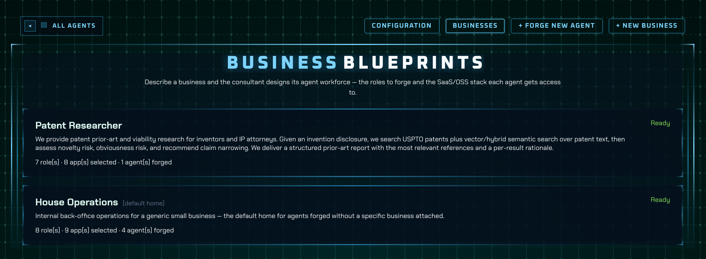
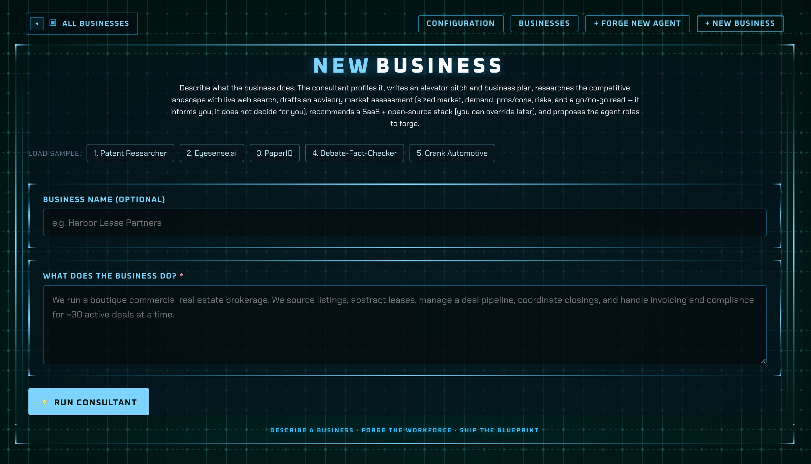
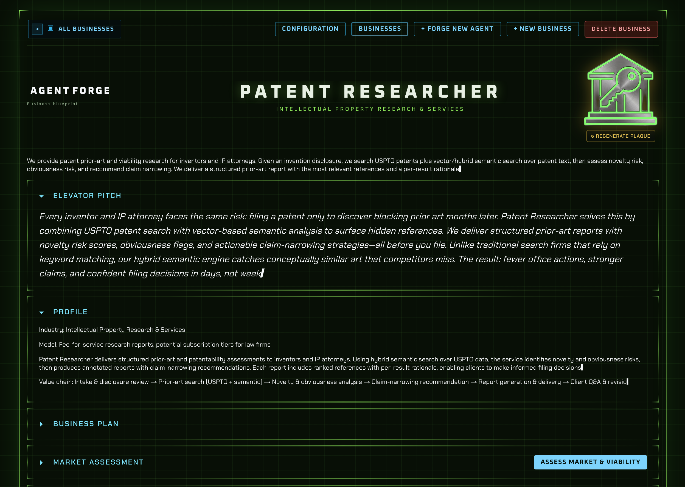
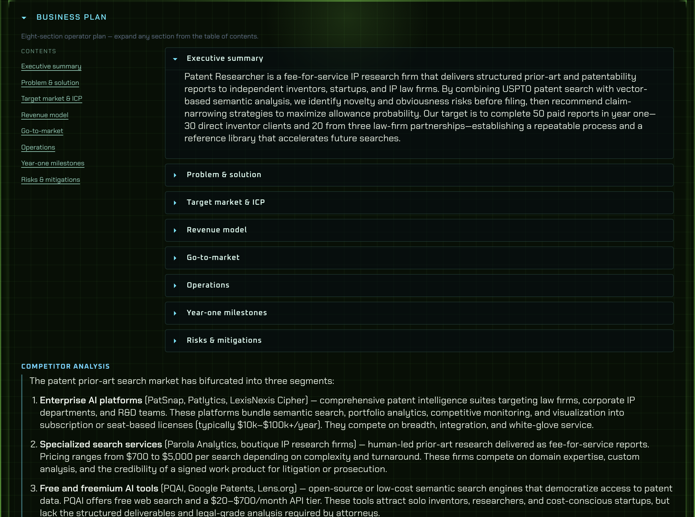
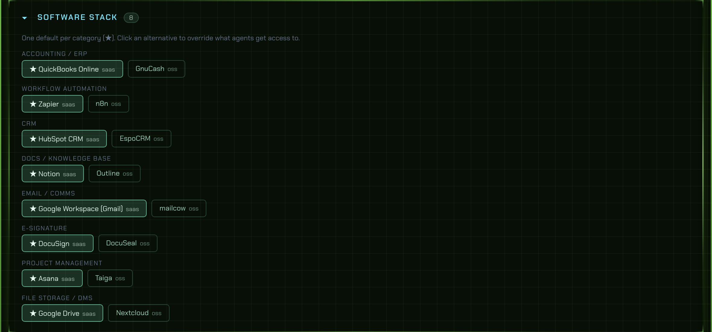
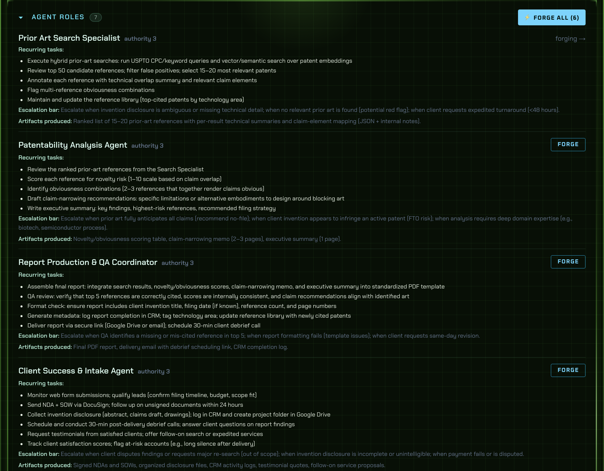

# Agent Forge

**Turn a business idea into an operating blueprint — then forge the AI staff to run it.**

Agent Forge takes a short business description and builds a complete **business blueprint**: profile, elevator pitch, structured business plan, competitor research, market intelligence, recommended software stack, and a roster of **agent roles** designed to run the operation.

From there, forge each role into a deployable AI operator with a tactical **command card** — identity, mission, metrics, decision framework, a detailed Markdown **skill file**, and custom **emblem, portrait, and icon**. The forge also maps which **SaaS platforms** each agent should use and at what **access level** (least privilege).

Describe a business. Design the plan. Forge the team. Ship the cards.

---

## See it in action

Walkthrough uses the **Patent Researcher** sample blueprint unless noted. Screenshots are full-width product captures from a local dev server.

### Business blueprints

Describe what the business does at **Businesses → New business**. A consulting agent profiles the company, drafts the plan, researches competitors and market viability, recommends a SaaS/OSS stack, and proposes agent roles — all streamed live on a turn timeline. Open the blueprint to review pitch, plan sections, competitor cards, market assessment, app stack, and forge roles one by one.

#### 1. Business blueprints roster — `/business`



The home for all operating blueprints. Each card shows the business name, a full description, status (`Ready`, `consulting`, etc.), and summary stats: how many **roles** were suggested, **apps** selected in the stack, and **agents** already forged from this blueprint. **House Operations (default home)** is the built-in placeholder for agents forged without attaching them to a specific business.

#### 2. New business — `/business/new`



Where a new blueprint starts. Enter an optional name and a plain-language description of what the company does — or click a **Load sample** preset (Patent Researcher, PaperIQ, etc.). **Run consultant** posts the description and starts the background consulting loop; progress streams on a turn timeline while profile, pitch, plan, competitors, market assessment, software stack, and roles are generated.

#### 3. Blueprint overview — `/business/[slug]`



Top of a finished blueprint: Gemini-generated **plaque**, business wordmark, industry tag, **elevator pitch**, and **profile** (business model, operator summary, value chain). Everything below — business plan, market assessment, software stack, agent roles — lives in collapsible sections you expand as needed.

#### 4. Business plan — blueprint → Business plan



The eight-section operator plan: executive summary, problem & solution, target market, revenue model, go-to-market, operations, year-one milestones, and risks & mitigations. A **Contents** sidebar jumps to any section; each block is collapsible. Sections fill during the initial consult or on demand via **Generate business plan** / **Complete business plan**. When competitor research has run, **Competitor analysis** appears in this same panel.

#### 5. Software stack — blueprint → Software stack



Recommended tooling for running the business. Every relevant app **type** gets a default pick (★) plus alternatives — typically a paid **SaaS** option and an **OSS** fallback. Click an alternate to override the default for that category; when you forge agents from this blueprint, the forge loop calls `set_app_access` using these selections (least privilege by default).

#### 6. Agent roles — blueprint → Agent roles



The consultant's proposed **staffing plan**: usually 4–8 roles mapped to the value chain, each with an authority hint (IC → executive), job description, recurring tasks, escalation rules, and expected artifacts. **Forge** creates one agent and sends it through the standard forge loop; **Forge all** queues every suggested role. Forged roles link to their command cards on the agent roster.

### Agent roster

Your forged agents live on a live-updating command grid. Cards fill in as generation runs — identity first, visuals early, skill file last.

#### 7. Agent command grid — `/`


The main **command grid**: forged agents grouped by business. Each card shows callsign, title, department, accent theme, and live generation status while the forge runs. Open a card for the full tactical drill-in. The **+ Forge new agent** tile at the bottom starts **Path B** — a single-agent forge without running the business consultant first.

### Forge form

Paste your business context and job description — or load **Use Example 1 / 2 / 3** for CRE lease abstraction, AP automation, or prior auth intake.

#### 8. Single-agent forge — `/new`


**Path B** entry point when you already know the role. Two fields — **business context** and **job description** — are enough to run the forge loop. **Use Example 1 / 2 / 3** loads realistic presets (commercial lease abstraction, AP automation, prior authorization intake) so you can demo without writing copy. Agents forged here land in **House Operations** unless you forge from a blueprint role instead.

### Command card detail

Every agent gets a full tactical drill-in: mission, objectives, I/O, metrics, escalation rules, deliverables, SaaS access grid, and a tap-to-open skill module.

#### 9. Command card — `/agent/[slug]`


The deployable operator spec for one forged agent. Header: generated **emblem**, **portrait**, callsign, title, and authority rank. Body: mission, Q1 objective, success criteria, decision framework, roles & responsibilities, I/O contract, escalation rules, and deliverables. The **SaaS access grid** lists which apps from the business stack this agent touches and at which **capacity** (viewer → owner). Tap the portrait or skill row to open the generated Markdown **skill module** (~180–320 lines) in an overlay.

---

## Why Agent Forge

| You bring | Agent Forge delivers |
|-----------|----------------------|
| A business idea (a paragraph is enough) | **Business profile** — industry, model, value chain, operator summary |
| “Is this worth pursuing?” | **Market intelligence** — TAM/SAM/SOM, demand signals, timing, pros/cons/risks, advisory viability verdict (with web research when keys are set) |
| Competitive context | **Competitor analysis** — landscape overview + 3–5 real rivals with positioning, pricing, strengths, weaknesses, and your edge |
| No written plan yet | **Eight-section business plan** — executive summary through risks & mitigations, collapsible TOC |
| Unknown tool stack | **Recommended SaaS + OSS stack** — default pick plus alternatives per app category; override per type on the blueprint |
| “Who runs this?” | **4–8 agent roles** — each with business context + job description, ready to forge |
| A role to deploy | A named agent with callsign, authority rank, accent theme, and **SaaS access grid** |
| A vague role (“handle prior auth intake”) | Mission, Q1 objective, success criteria, decision framework, roles & responsibilities |
| Nothing visual | Gemini-generated business **plaque**, agent **emblem**, **portrait**, and HUD **icon** (with transparency pipeline) |
| Tribal knowledge in people's heads | A 180–320 line Markdown **skill file** your team (or another AI) can run tomorrow |

**Built for:**

- **Founders & operators** pressure-testing a business idea before building
- **Ops leaders** prototyping agent roles and software access before production wiring
- **Solutions teams** demoing document-intelligence workflows to customers
- **Builders** who want opinionated specs — business plan, market read, agent roster — not blank ChatGPT threads

**Not another chat UI.** Agent Forge is a foundry: structured output, persistent blueprints and roster, editable prompts, and a UI your stakeholders actually want to open.

---

## Quick start

```bash
git clone https://github.com/tguless/agent-forge.git
cd agent-forge
npm install
cp .env.example .env.local   # add ANTHROPIC_API_KEY (+ GEMINI_API_KEY for visuals; TAVILY_API_KEY for market research)
./start.sh                   # http://localhost:3030
```

### Path A — Business blueprint (recommended first run)

1. Open **Businesses → + New business** (`/business/new`).
2. Describe the business in plain language (what it does, who it serves).
3. Watch the **consulting timeline** — profile, pitch, plan sections, competitors, market assessment, app stack, roles.
4. Open the blueprint at `/business/[slug]` — review pitch, plan, competitors, viability verdict, software stack.
5. Click **Forge** on any suggested role to spawn an agent; repeat until the staff is built.

### Path B — Single agent

1. Open **Forge new agent** (or the **+** tile on the roster).
2. Fill in business + role — or click **Use Example 1**.
3. Watch the live forge log; open the command card when complete.
4. Tap the portrait to read the generated skill module; review the **SaaS access grid** on the detail page.

Optional: tune every LLM prompt under **Configuration** (`/config`).

---

## What's included

### Business generation

- **Business consulting agent** — multi-turn Claude tool loop profiles the business and writes the operating blueprint
- **Structured business plan** — eight sections (executive summary → risks), collapsible TOC, on-demand regeneration
- **Competitor analysis** — Tavily/Serper-backed research; landscape + per-competitor cards (positioning, pricing, strengths, weaknesses, your edge)
- **Market assessment** — TAM/SAM/SOM, demand signals, timing, enumerated risks, pros/cons, **advisory viability verdict** (informational — you decide go/no-go)
- **Business identity plaque** — Gemini-generated riveted HUD mount for the blueprint header
- **Software stack recommendations** — paid SaaS default + OSS alternative per app type; override selection on the blueprint
- **Role suggestions** — 4–8 forge-ready roles mapped to the value chain, with authority hints (IC / leader / executive)
- **Live SSE timeline** — consulting turns persisted and replayable after refresh

### Agent forging

- **Live roster grid** — agents update while forging
- **Three example presets** — CRE, AP automation, healthcare prior auth
- **Command cards** — mission, metrics, deliverables, roles & responsibilities, tap-to-open skill module
- **SaaS access grid** — per-agent app grants at validated capacity levels (viewer → owner)
- **Visual identity pipeline** — Nano Banana (Gemini) + rembg + ImageMagick, graceful fallbacks

### Platform

- **Forge Configuration** — edit Anthropic system prompts, meta skills, and Gemini image templates (SQLite-backed)
- **Skill module overlay** — GFM Markdown with tables, same renderer in config preview
- **Local-first** — SQLite database, no cloud dependency beyond LLM/image/search APIs

---

## Technical reference

### How it works

**Business blueprint flow**

```
/business/new (describe the business)
   → POST /api/businesses
       → businessRunner.ts — Claude ToolLoopAgent + businessTools
           set_business_profile      industry, model, value chain, summary
           generate_plaque           Gemini business identity mount
           set_elevator_pitch        30–45 second spoken pitch
           set_plan_* (×8)           executive summary → risks & mitigations
           tavily_search +           competitor landscape + 3–5 rivals
             set_competitor_*        positioning, pricing, strengths, …
           set_market_* +            TAM/SAM/SOM, demand, timing, risks,
             set_viability_verdict   pros/cons, advisory go/no-go read
           recommend_app (×N)        SaaS default + OSS alt per app type
           suggest_role (×4–8)       forge-ready businessContext + jobDescription
           finalize_blueprint
       → SSE turn stream (/api/businesses/[slug]/stream)
       → SQLite: businesses, roles, app stack, plan, competitors, market
/business/[slug]  → blueprint UI: pitch, plan TOC, competitors, market verdict,
                    app stack override, role list, forged agent licenses
   → POST /api/businesses/[slug]/forge  (per role)
       → agentRunner.ts — same forge loop as /new, scoped to business stack
           set_app_access              SaaS grid: app + capacity per agent
```

**Single-agent forge flow**

```
/new (business + job description)
   → POST /api/agents/generate
       → Claude tool-use loop (src/lib/server/agentRunner.ts)
           set_identity
           → generate_image (emblem, portrait, icon)  [Gemini + rembg + magick]
           → set_narrative → set_lists → set_metrics
           → write_skill_file
           → finalize
       → writes to SQLite (data/forge.db) + emits generation events
   → live progress log (polls /api/agents/[slug]/events)
/        → index grid of all forged agents (grouped by business)
/agent/[slug] → full command card + SaaS access grid + tap-to-open skill module
/config  → edit all LLM prompts (Anthropic + Gemini), stored in forge_config
```

Meta-skills (how to consult on a business, design identity, author skill files, and choose visuals) live in [`skills/`](./skills) and are injected into the system prompt. Overrides from `/config` take precedence.

### Setup

```bash
cd agent-forge
npm install
cp .env.example .env.local   # fill in your keys
npm run dev                  # http://localhost:3030
# or
./start.sh                   # pins Node 18 via nvm + rebuilds better-sqlite3 if needed
```

### Environment (`.env.local`)

| Variable | Required | Purpose |
|----------|----------|---------|
| `ANTHROPIC_API_KEY` | **Yes** | Business consulting, agent forge, plan generation (Claude tool loops). |
| `ANTHROPIC_MODEL` | No | Defaults to `claude-sonnet-4-5`. |
| `TAVILY_API_KEY` | Recommended | Web search for **competitor analysis** and **market assessment** (best signal). |
| `SERPER_API_KEY` | Optional | Fallback web search if Tavily is unset. Without either key, research runs with weaker link-only signal. |
| `GEMINI_API_KEY` | Recommended | Business **plaque** + agent **emblem/portrait/icon** via Nano Banana. Text + plan still generate without it. |
| `GEMINI_IMAGE_MODEL` | No | `gemini-3-pro-image-preview` (Pro) or `gemini-3.1-flash-image-preview` (Flash). |
| `GEMINI_IMAGE_SIZE` | No | `2K` by default (Gemini 3 models). |
| `REMBG_PYTHON` | No | Path to a Python venv with `rembg` + `Pillow`. Auto-detects the repo's shared rembg venv. |
| `ICON_WHITE_FUZZ` | No | ImageMagick white→alpha fuzz for icons (default `14%`). |
| `EMBLEM_PIPELINE` | No | `classic` (default): rembg + 14% fuzz + PIL trim. `sharp`: magick defringe only. |
| `EMBLEM_WHITE_FUZZ` | No | White key fuzz for emblems (default `14%` in classic mode). |
| `EMBLEM_USE_REMBG` | No | Run rembg on emblems in classic mode (default on; set `0` to disable). |
| `EMBLEM_REMBG_MIN_RATIO` | No | Skip rembg when wing bbox shrinks below this fraction of raw (default `0.72`). |
| `EMBLEM_MARGIN_PCT` | No | PIL trim margin for emblems (default `5`). |
| `EMBLEM_POST_WHITE_FUZZ` | No | Sharp mode only: post-resize edge cleanup (default `3%`). |
| `EMBLEM_ALPHA_THRESHOLD` | No | Sharp mode only: alpha binarize after resize (default `65%`). |

> **Note:** Nano Banana runs on Gemini, so visual generation needs a `GEMINI_API_KEY` in addition to your Anthropic key. Background removal additionally needs a `rembg` venv and `ImageMagick` (`magick`); all three steps degrade gracefully if a tool is missing.

### Stack

- **Next.js 14** (App Router) + TypeScript
- **better-sqlite3** — local DB at `data/forge.db`
- **@anthropic-ai/sdk** — tool-use agent loop (streamed)
- **@google/genai** — Nano Banana image generation
- **react-markdown** + **remark-gfm** — skill module rendering (with tables)

### Layout

```
src/
  app/
    page.tsx                  index grid (live)
    new/page.tsx              forge form + generation progress
    config/page.tsx           LLM prompt editor
    agent/[slug]/page.tsx     command card + SaaS access grid (live while forging)
    business/page.tsx         business roster
    business/new/page.tsx     describe a business + live consulting timeline (SSE)
    business/[slug]/page.tsx  blueprint: pitch, plan, competitors, market verdict, app stack, roles, forge queue
    api/agents/...            generate, list, detail, skill, events, access
    api/businesses/...        CRUD, SSE stream, turns, app override, forge
    api/catalog/...           apps + capacities (controlled vocabulary)
    api/forge/config/         prompt CRUD + reset
  components/                 ForgeHudHeader, HudBox, AgentCommandCard,
                              AgentDetailCommandCard, AgentAccessGrid, TurnTimeline, ...
  lib/
    db.ts, agentStore.ts, businessStore.ts, catalogStore.ts, accessStore.ts
    catalogSeed.ts            seed capacities + app types + starter SaaS/OSS apps
    forgeConfigStore.ts, forgePrompts.ts
    agent/                    shared ToolLoopAgent runtime
      runtime.ts              generic ToolLoopAgent driver -> turn stream
      turns.ts, runRegistry.ts, types.ts
    server/
      agentRunner.ts          forge loop (ToolLoopAgent) + app-stack injection
      forgeTools.ts           forge Zod tools incl. set_app_access (access grid)
      businessRunner.ts       full consulting loop (ToolLoopAgent) + placeholder bootstrap
      businessPlanRunner.ts   on-demand eight-section plan regeneration
      marketAssessmentRunner.ts on-demand market + viability verdict
      businessTools.ts        consulting Zod tools (profile, pitch, plan, competitors, market, apps, roles)
      turnStream.ts           SSE helper (tails the turn timeline)
      imagePipeline.ts        Gemini + rembg + ImageMagick (graceful degrade)
  styles/                     operations-dashboard.css, operations-detail.css, forge.css
skills/                       generator meta-skills (defaults for system prompt)
screenshots/                  README product shots
public/
  forge/detail-icons/         HUD section icons
  agents/<slug>/              generated emblem.png, portrait.png, icon.png
data/forge.db                 SQLite (gitignored)
```

### Business blueprints — full reference

Agent Forge's business layer turns a short description into an **operating blueprint** for an AI-agent workforce. This is separate from (but feeds) the single-agent forge.

#### What you provide

One paragraph (or a few) describing what the business does, who it serves, and how it creates value. No forms beyond name + description — the consultant agent makes strong default choices.

#### What the consultant generates

| Deliverable | Where it lives | Notes |
|-------------|----------------|-------|
| **Business profile** | Blueprint → Profile | Industry, business model, value chain (4–7 stages), operator summary |
| **Identity plaque** | Blueprint header | Gemini riveted HUD mount; workflow-specific glyph, not generic stock art |
| **Elevator pitch** | Blueprint → Pitch | ~50–90 words, spoken in 30–45 seconds |
| **Business plan (×8)** | Blueprint → Plan | Executive summary, problem/solution, target market, revenue model, GTM, operations, year-one milestones, risks |
| **Competitor analysis** | Blueprint → Competitors | Landscape + 3–5 **real** companies with positioning, offerings, pricing, strengths, weaknesses, your edge; sourced via web search |
| **Market assessment** | Blueprint → Market | TAM/SAM/SOM, demand signals, timing, pros/cons, enumerated risks, **advisory viability verdict** |
| **Software stack** | Blueprint → Apps | For each relevant app **type**: a default SaaS pick, OSS alternative, and optional alternates; you override the default per type |
| **Agent roles** | Blueprint → Roles | 4–8 distinct roles with `businessContext`, `jobDescription`, authority hint, and rationale — each is one click from forge |

The market verdict (`pursue` → `reconsider`) is **always advisory**. The agent surfaces pros, cons, and risks so **you** decide — it never refuses to give a candid read.

#### End-to-end workflow

1. **Create** — `/business/new` → POST `/api/businesses` → background consult starts (`status: consulting`).
2. **Watch** — SSE stream at `/api/businesses/[slug]/stream` drives the turn timeline; turns persist in `agent_turns` for replay after refresh.
3. **Review** — `/business/[slug]` when `status: ready` — collapsible sections for pitch, plan, competitors, market, apps, roles, forged agents.
4. **Override stack** — pick a different app per type on the blueprint (SaaS vs OSS vs alternate).
5. **Forge roles** — POST `/api/businesses/[slug]/forge` per role → standard agent forge loop, scoped to the business's selected stack.
6. **Operate** — each forged agent gets a command card at `/agent/[slug]` with mission, metrics, skill file, and **SaaS access grid**.

Every agent belongs to a business. A **placeholder business** ("House Operations") bootstraps on first run and adopts standalone agents. Agents forged without a business context land there until reassigned.

#### What each forged agent includes

When you forge a role from a blueprint (or forge ad hoc from `/new`):

- **Identity** — callsign, title, department, authority rank (1–5), accent theme
- **Mission block** — Q1 objective, success criteria, deliverables
- **Roles & responsibilities** — decision framework, escalation rules, I/O contract
- **Skill file** — 180–320 line Markdown module (`*.skills.md`), tap-to-open overlay
- **Visuals** — emblem, portrait, operator icon (Gemini + transparency pipeline)
- **SaaS access grid** — which apps from the business stack this agent touches, at which **capacity** (controlled vocabulary: `viewer` → `owner`, validated per app type)

The forge loop calls `set_app_access` to populate the grid using the business's **selected** stack — least-privilege by default.

#### On-demand regeneration

| Action | Endpoint / UI | Scope |
|--------|---------------|-------|
| **Regenerate business plan** | Blueprint → "Generate business plan" / "Complete business plan" | Eight plan sections only; does not change apps, roles, or status |
| **Regenerate market assessment** | Blueprint → "Assess market & viability" / "Complete market assessment" | Market sizing, demand, risks, and viability verdict only (`marketAssessmentRunner.ts`) |
| **Re-consult** | Re-run consult (API) | Full blueprint refresh |

Plan-only runs use `businessPlanRunner.ts`; full consult uses `businessRunner.ts`.

#### Capacities & catalog

- **App types** and starter SaaS/OSS apps are seeded in `catalogSeed.ts`.
- The consultant may **`recommend_app`** from the catalog or invent a new app when nothing fits.
- **`define_capacity`** can extend the controlled vocabulary; grants are validated against each app's allowed subset.
- Access grids on agent detail pages show effective grants per app.

#### Configuration & prompts

Business consulting behavior is driven by:

- `skills/04-business-consultant.skill.md` — default consultant discipline
- `forgePromptDefaults.ts` → **Business Consultant** category in `/config`
- Tool implementations in `src/lib/server/businessTools.ts`

Tune competitor depth, role count, or stack philosophy by editing those prompts.

#### Relevant environment

| Variable | Default | Purpose |
|----------|---------|---------|
| `FORGE_CONSULT_MAX_STEPS` | `80` | Max tool steps for full business consult |
| `FORGE_MAX_STEPS` | `40` | Max tool steps for single-agent forge |
| `TAVILY_API_KEY` / `SERPER_API_KEY` | — | Web research quality for competitors + market |

Both consulting and forge run as **background tasks** in the Node server process. Use `npm run dev` / `npm run start` (long-lived process), not serverless.

### Notes

- Generated images are written under `public/agents/<slug>/` and business plaques under `public/businesses/<slug>/`; served statically.
- The UI/CSS is lifted from the PaperIQ operations command center; data comes from SQLite instead of a hard-coded registry.
- Prompt overrides are stored in the `forge_config` SQLite table; **Reset to default** restores shipped values from `forgePromptDefaults.ts` and `skills/*.md`.
- Consulting streams turns over **SSE**; forging polls **generation events**. Both require a long-lived Node process.

---

## License

See repository license. Built by [Ted Gulesserian](https://github.com/tguless).
