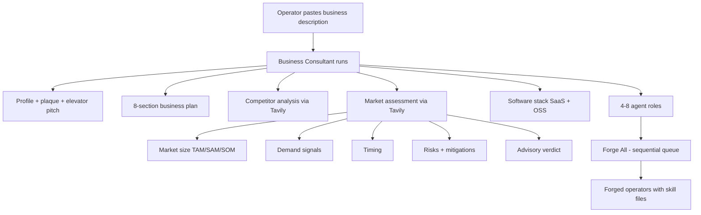

# Agent Forge: Business Blueprints and Market Assessment

**What we are building, why it matters after the chatbot era, and how the advisory market-assessment layer works.**

Live demo: [agent.paperiq.ai](https://agent.paperiq.ai) · Example blueprint: [agent.paperiq.ai/business/patent-researcher](https://agent.paperiq.ai/business/patent-researcher)

---

## 1. The post-AI problem

Generative AI made it trivial to *describe* work. It did not make it trivial to *organize* work.

Most teams today still operate in one of two modes:

1. **Blank chat threads** — smart answers, zero structure, nothing persists, nothing composes.
2. **Traditional planning** — slide decks, Notion docs, and consultant decks that take weeks and still do not produce runnable operators.

In a post-AI world, the scarce resource is not text generation. It is **judgment under uncertainty**: Which roles do we need? Which software do they touch? What does “good” look like? Is this business idea worth six months of our life?

Chat interfaces are excellent at improvisation. They are poor at **institutional memory**, **repeatable operating specs**, and **honest pre-mortems**. The gap between “I had an idea” and “I have a workforce design I can execute” is still wide — and it is where most AI-native startups either win or waste a year.

**Agent Forge** exists to close that gap. Not with another chat box, but with a **foundry**: structured artifacts, persistent rosters, live generation you can watch, and outputs your team (or downstream agents) can actually run.

---

## 2. What Agent Forge is

Agent Forge turns short natural-language inputs into **deployable AI operator specs**.

At the agent level, you provide:

- A **business context** (what the company does)
- A **job description** (what one role must accomplish)

Agent Forge produces a full **command card**: identity, mission, metrics, decision framework, a 180–320 line Markdown **skill file**, and custom **visual identity** (emblem, portrait, icon). Operators open the card; they do not scroll through chat history.

At the **business** level — the focus of this document — you provide something even simpler:

> One paragraph describing what the business does.

From that single prompt, the **Business Consultant** builds an entire **operating blueprint**:

| Output | Purpose |
|--------|---------|
| Business profile | Industry, model, value chain, operator-grade summary |
| Identity plaque | Visual sector badge (Gemini-generated riveted mount) |
| Elevator pitch | 30–45 second spoken pitch |
| Eight-section business plan | Executive summary through risks & mitigations |
| Competitor analysis | Live web research (Tavily) on real rivals, pricing, positioning |
| **Market assessment** | Sized market, demand signals, pros/cons, risks, advisory verdict |
| Software stack | Recommended SaaS + open-source apps per category |
| Agent roles | 4–8 forge-ready roles (COO, engineering, growth, etc.) |

Then you **Forge All** — each role becomes a licensed operator with portrait, emblem, skill module, and access grid.

Everything on a blueprint page like [Patent Researcher](https://agent.paperiq.ai/business/patent-researcher) is generated from that one description. The UI is built for operators and stakeholders, not for reading raw LLM transcripts.

---

## 3. Why this matters in a post-AI world

### 3.1 Structure beats prompts

Prompt engineering was the first wave. **Operating design** is the next.

Enterprises do not need more generic assistants. They need:

- Named roles with clear authority
- Escalation bars and artifacts produced
- Least-privilege access to real systems (CRM, billing, analytics)
- Specs that survive employee turnover

Agent Forge treats agents like **job descriptions with teeth** — not chat personas.

### 3.2 Speed without stupidity

AI makes it easy to *start* building. It does not tell you whether you *should*.

The new **Market Assessment** layer adds what every founder secretly wants and every cheerleader bot avoids:

> “Don’t be a dumbass. Here are the pros, cons, and risks if you choose to take them.”

It never decides for you. It **informs** your decision with evidence: market size, demand signals, timing, ranked risks, and an advisory verdict on a five-point scale.

That combination — **fast generation + honest viability read** — is the difference between a toy demo and a tool you trust before committing runway.

### 3.3 Composability

Blueprint outputs are not trapped in chat:

- Business plan sections are separate tool calls → collapsible UI, table of contents
- Competitors are one card per rival → subsections with source URLs
- Agent roles are forge prompts → one click to materialize operators
- Prompts are editable in `/config` → you own the consulting behavior

This is how you build **agent-native companies**: design the org chart first, then forge the workers.

---

## 4. The Market Assessment enhancement

### 4.1 The gap it fills

Before this change, the consultant produced:

- A **target market** section inside the business plan (ICP, segments, buying triggers)
- A **competitor analysis** (who else plays here, pricing, strengths, weaknesses)
- A **risks & mitigations** section (operational and strategic risks)

Useful — but not the same as answering:

- **How big is the market?** (TAM / SAM / SOM, with math and citations)
- **Is there real demand?** (search trends, hiring, funding, willingness to pay — graded strong vs. weak)
- **Why now?** (tailwinds, headwinds, regulatory or technology shifts)
- **Should I pursue this?** (pros, cons, enumerated risks, advisory verdict)

The plan optimistically assumes you are building. The market assessment **stress-tests the premise** before you forge eight agents and tell LinkedIn you are launching.

### 4.2 Design principle: advisory, never binding

The verdict is explicitly **informational**:

- Five levels, most → least favorable: `pursue` · `pursue-conditional` · `mixed` · `high-risk` · `reconsider`
- Confidence: `low` · `medium` · `high` (based on evidence quality)
- Pros and cons as parallel lists
- Risks with severity, optional likelihood, and concrete mitigation
- A closing recommendation that states which way evidence leans — and explicitly says **the operator decides**

The UI displays:

> *Advisory only — pros, cons, and risks to inform your call. Agent Forge does not decide for you.*

This is intentional. The product’s job is to surface uncomfortable truths (tiny markets, crowded spaces, unproven demand), not to kill ideas or pretend certainty where none exists.

### 4.3 Example read (hand-cranked cars)

For a novelty idea like “we sell hand-cranked cars,” a candid assessment would:

- Size a **niche/restoration/collector** SAM (small) vs. any imagined mass-market TAM (effectively zero)
- Flag **weak demand signals** for new hand-cranked vehicles as daily transport
- Note **timing headwinds** (regulation, safety, EV transition)
- List risks: liability, manufacturing scale, buyer pool
- Likely verdict: **`reconsider`** — with an honest note about where a *narrow* wedge (museum pieces, film props, ultra-niche restomod) might still justify a **`pursue-conditional`** path if validated cheaply first

That is the product working as designed.

---

## 5. What changed (technical overview)

### 5.1 Data model

New type on `BusinessProfile`:

```typescript
marketAssessment?: MarketAssessment
```

`MarketAssessment` includes:

| Field | Description |
|-------|-------------|
| `marketSize` | Markdown: TAM / SAM / SOM with figures and assumptions |
| `demandSignals` | Markdown: evidence of demand, graded strong vs. weak |
| `timing` | Markdown: why-now, tailwinds and headwinds |
| `pros` | String array — reasons it could work |
| `cons` | String array — reasons it might not |
| `risks` | Array of `{ risk, severity, likelihood?, mitigation? }` |
| `verdict` | Advisory enum (see above) |
| `confidence` | `low` \| `medium` \| `high` |
| `headline` | One-line honest read |
| `recommendation` | Markdown closing; frames decision as operator’s |
| `sources` | URLs from web search |

Stored in the existing SQLite `profile` JSON column — **no schema migration required**.

### 5.2 Consultant tools (agent-callable)

New tools in `src/lib/server/businessTools.ts`:

| Tool | Role |
|------|------|
| `set_market_size` | TAM/SAM/SOM with citations |
| `set_demand_signals` | Demand evidence, strong vs. weak |
| `set_market_timing` | Why-now / trends |
| `add_market_risk` | One risk per call (3–6 total); severity + mitigation |
| `set_viability_verdict` | Verdict, headline, pros, cons, recommendation |

These reuse the existing **`tavily_search`** tool (Tavily-first, Serper/DuckDuckGo fallbacks) for evidence — same pipeline as competitor research.

**Full consult** (`createBusinessTools`): market tools run as **step 6**, after competitor analysis and before app stack + roles.

**On-demand run** (`createMarketAssessmentRunTools`): dedicated tool set + `finalize_market_assessment` for backfilling existing blueprints.

### 5.3 Prompts

New configurable prompts (editable at `/config`):

- `business.market.system` — Market Analyst persona and tool sequence
- `business.market.user_template` — Business description + existing profile context

Updated `business.system` (full consult) to include market assessment in the standard blueprint sequence.

Prompt rules emphasize:

- Cite sources; do not invent false precision
- Be honest, not a cheerleader
- Never decide for the operator

### 5.4 Runners and API

| Path | Purpose |
|------|---------|
| Full consult | `startBusinessConsult()` — includes market assessment automatically for new businesses |
| On-demand | `POST /api/businesses/[slug]/market` — backfill for existing blueprints |
| Runner | `src/lib/server/marketAssessmentRunner.ts` |

On-demand runs share the **`business-plan` turn scope** and **`plan` run lock** with plan generation so they cannot collide with a consult on the same slug. Live progress streams over the existing plan SSE channel.

### 5.5 UI

New **`MarketAssessmentViewer`** component on the blueprint page:

- Color-coded **verdict badge** (green → red by tone)
- Confidence chip
- Collapsible sections for market size, demand, timing
- Side-by-side **pros / cons**
- **Risk list** with severity chips and mitigation lines
- Recommendation block and source URLs

New blueprint section: **“Market assessment”** with button **“Assess market & viability”** when not yet complete.

Styles in `src/styles/forge.css` (`.forge-verdict*`, `.forge-proscons*`, `.forge-risk*`).

### 5.6 API flags

`GET /api/businesses/[slug]` now returns:

- `hasMarketAssessment` — any content present
- `marketComplete` — verdict + core sections + pros/cons/risks all saved

---

## 6. End-to-end flow



For an existing blueprint (e.g. Patent Researcher created before this feature):

1. Open `/business/patent-researcher`
2. Click **Assess market & viability**
3. Watch the live research timeline
4. Review verdict, pros/cons, and risks before forging more roles

Requires `ANTHROPIC_API_KEY`; best results with `TAVILY_API_KEY` for web research.

---

## 7. Related capabilities (context)

These shipped alongside the blueprint layer and compose with market assessment:

| Capability | What it does |
|------------|--------------|
| **Sequential Forge All** | Queues agent generation one-at-a-time to avoid server overload; progress bar on blueprint page |
| **Operator license cards** | Driver-license-style forged agent cards (portrait, emblem, callsign, inline endorsements) |
| **Emblem wing retry** | Auto-regenerates emblems when Gemini clips wing tips at canvas edge (up to 3 attempts) |
| **Business back navigation** | Agent detail pages link back to parent business blueprint |
| **Mobile-responsive blueprint** | Tighter typography and layout on small screens |

Together, the story is: **one prompt → consult-grade blueprint → honest viability read → forged operator roster**.

---

## 8. Configuration and operations

### Environment

| Variable | Role |
|----------|------|
| `ANTHROPIC_API_KEY` | Consultant, plan writer, market analyst |
| `TAVILY_API_KEY` | Market + competitor web research (recommended) |
| `GEMINI_API_KEY` | Business plaques and agent visuals |
| `FORGE_MARKET_MAX_STEPS` | Optional cap on market-assessment tool loop (default 40) |

### Prompt tuning

All consulting behavior is overrideable at **`/config`** without code changes:

- Business consultant system prompt
- Market assessment system + user template
- Business plan writer
- Meta skill: `skills/04-business-consultant.skill.md` (note: skill file may lag code — prefer `/config` for market steps)

### Deploy

Standard eyesense deploy after pull:

```bash
ssh eyesense 'cd ~/agent-forge && git pull --ff-only && ./scripts/deploy-eyesense.sh'
```

---

## 9. What we are not building (yet)

To set expectations:

- **No automated “kill switch”** — we will not block forging or hide the blueprint based on verdict
- **No financial modeling spreadsheet** — revenue model stays in the business plan; market assessment focuses on size/demand/timing/viability
- **No roster verdict badge** — verdict is on the blueprint page today; surfacing it on business list cards is a natural follow-up
- **No separate MCP server** — tools are in-process Vercel AI SDK tools, same as competitor research (not a standalone MCP package)

---

## 10. Summary

**Agent Forge** is infrastructure for the post-chatbot era: turn descriptions into **structured operating blueprints** and **forge-ready AI operators**.

The **Market Assessment** layer adds the missing honest friend: sized market, demand evidence, pros and cons, ranked risks, and an advisory verdict — so you can decide with eyes open before you forge the org chart.

One prompt in. Consult-grade blueprint out. The decision stays yours.

---

*Document version: June 2026 · Agent Forge (`agent.paperiq.ai`)*
